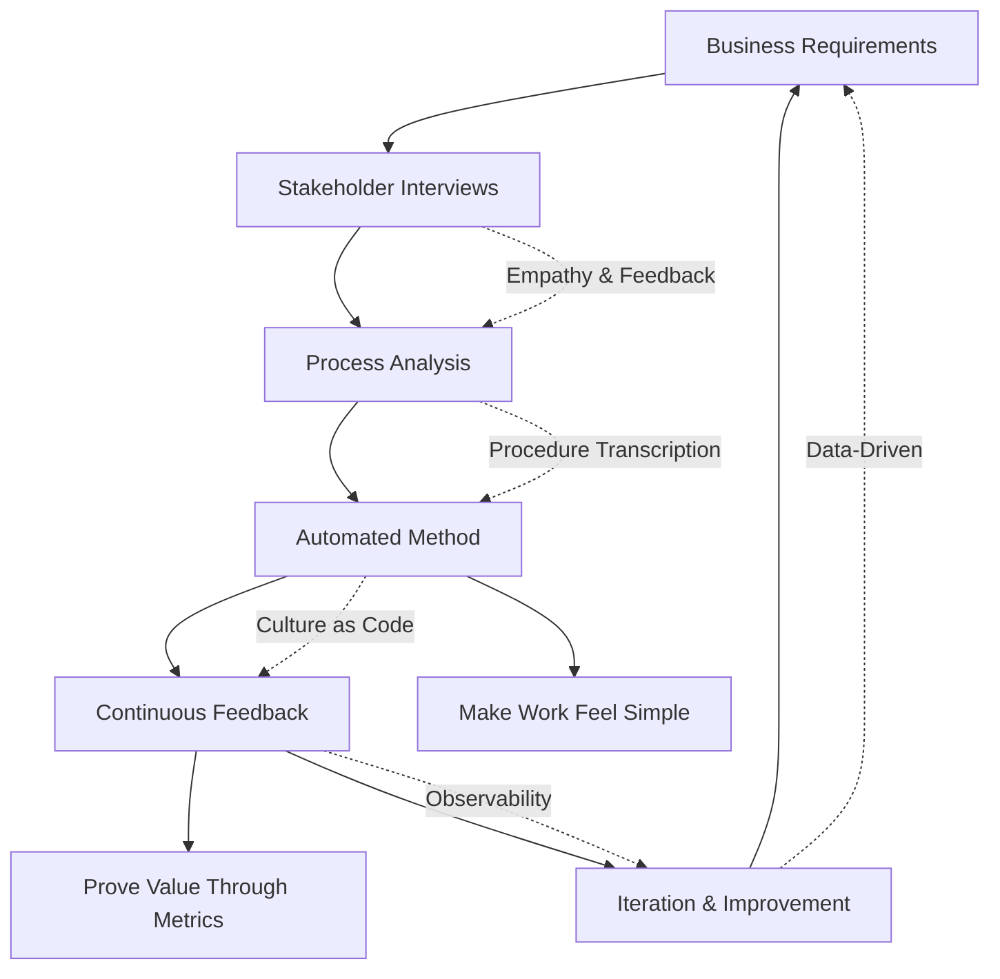
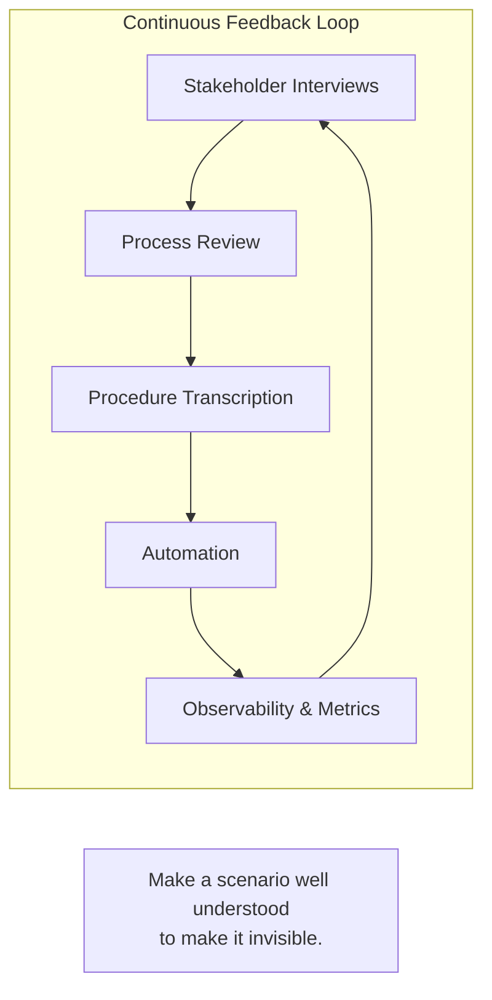

# Zachary Norman
## Software, DevOps, & Business Automation Engineer

**Core Functions:**
- DevOps & Platform Engineering - Right sized infinite scale
- Establish technical coherence to meet business objective requirements
- Production Pipeline Development and Release Engineering
- Security & Compliance as Code (FedRAMP, GDPR, NIST 800-53)
- Programmatic Infrastructure for Machine Learning / Large-Language Models / Data-Ops 
- Kubernetes platform automation serving hundreds of developers

**Background**
After reading Neal Stephenson's "In the Beginning was the Commandline" I began running linux exclusively, mainly for its flexibility and ease of software availability.

I'm a hacker, cinemafile, and musician who serves teams through bespoke automation systems.

Significantly, it helped me understand that:
- Open software works better
- Proprietary systems inherently are not ones own
- Good software is fashionable, as in malleable, composable, and extensible

**Motivation**
Workforces deserve deep focus to reach creative plateaus to address difficult problems.

I make scenarios, problems, and processes well understood to make them routine and invisible.

### Core Philosophy: "Culture as Code"

**Automation is for people.** Catering premier workflow ergonomics to teams is the focus but speed and efficiency is an outcome. I focus on:

- **Empathy, Feedback, and Iteration** - Understanding pain points to make work fun, fast, and correct
- **Elegance Accelerates Business** - Sustainable design pays dividends forever regardless of tooling  
- **Deep Focus Enablement** - Eliminating sources of tedium, context-shifting and manual involvement

**Main Problem Domain:** Anything with a person, a process, and a computer or API.

### Technical Approach

I enable teams to focus on their core skill sets by eliminating routine business process tedium. This requires:

- **Collaboration & Well-Articulated Requirements** - Socializing problems, defining assumptions
- **GitOps All The Things** - Culture reflected in code accelerates business
- **Observability-Driven Development** - Proving value through scorecards and metrics

